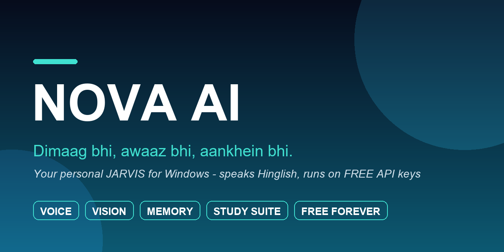

<div align="center">



**Your personal JARVIS for Windows — speaks Hinglish, runs on FREE API keys**

*"Nova, aaj ki news sunao" · "Is thali ki photo se calories batao" · "meri files saaf karo"*

**200+ functions · Voice + Vision + Memory · Made for Indian students**

</div>

---

<!-- TODO: real app screenshot yahan daalo (jab Nova kholi ho):

Banao: Nova kholo -> .venv\Scripts\python.exe capture_nova.py  (assets/ me save hota hai)
-->


Nova AI ek desktop AI assistant hai jo aapke Windows PC par **local Python app** ki tarah chalti hai. Chat karti hai, **bolti aur sunnti** hai, aapki **screen aur camera dekh sakti** hai, khane ki photo se **calories nikalti** hai, aapki baatein **yaad rakhti** hai, aur files ko **safely manage** karti hai — sab kuch aapki shakal ke saamne, audit log ke saath.

> 💰 **Zero subscription.** Nova free-tier API keys par chalti hai (Groq + Gemini + NewsAPI + OpenWeather — sab free).

---

## ✨ Features

| | Feature | Kya karti hai Nova |
|---|---|---|
| 🧠 | **AI Brain** | Groq LLM se chat — Hinglish naturally samajhti hai |
| 🎙️ | **Voice** | Awaaz se baat karo (STT) + jawab bol kar deti hai (TTS) |
| 👁️ | **Vision** | Screen analysis, camera se sawaal, photo OCR (Gemini + Tesseract) |
| 🍛 | **Nutrition** | Thali ki photo se calories, protein, carbs, fats ka estimate |
| 📰 | **News + Weather** | Daily briefing — cricket, defence, strategic affairs, kisi bhi topic par |
| 🧠💾 | **Memory** | Naam, birthday, pasand — sab yaad rakhti hai (encrypted storage) |
| 📚 | **Study Suite** | Daily routine, study coach, SRS flashcards, exam tracker, analytics dashboard, focus timer, quizzes |
| 🗂️ | **Safe File Agent** | Delete/move/rename/search — par sirf allowed folders me, confirmation ke saath, audit log ke saath |
| 🕵️ | **AI-Image Detector** | Koi photo AI-generated hai ya asli — check karta hai |
| 💬 | **Telegram Bridge** | Phone se apne PC wali Nova se baat karo |
| 📅 | **Calendar Sync** | Goals/tasks calendar (.ics) me |
| ⌨️ | **Ctrl+Z Hotkey + System Tray** | Kahin se bhi Nova ko bulao |
| 🔒 | **Privacy Mode** | Sensitive cheezein screen-analysis me chhupi rehti hain |
| 🩺 | **Nova Doctor** | "doctor" bolo — khud apni health check karti hai |
| 🎨 | **Emoji Chat** | Chat bubbles me proper colour emojis |

**Security first:** File actions ke liye allow-listed roots, forbidden paths (Windows/Program Files), symlink protection, per-minute rate limits, destructive actions par confirmation modal, aur append-only audit log. *(190 automated tests included.)*

---

## 🚀 Quick Start

```bash
# 1. Clone + enter
git clone <your-repo-url> nova.ai
cd nova.ai

# 2. Virtual env + dependencies (Python 3.11+)
python -m venv .venv
.venv\Scripts\activate
pip install -r requirements.txt

# 3. API keys — .env file banao (env.example copy karo)
copy env.example .env
#    In sab ke FREE keys milte hain:
#    GROQ_API_KEY     -> https://console.groq.com
#    GEMINI_API_KEY   -> https://aistudio.google.com/apikey
#    NEWS_API_KEY     -> https://newsapi.org
#    WEATHER_API_KEY  -> https://openweathermap.org/api

# 4. (Optional) Tesseract OCR — screenshots se text padhne ke liye
#    https://github.com/UB-Mannheim/tesseract/wiki

# 5. Chalao!
python main.py
```

**Bas.** Pehli baar me "doctor" type karke check karo ki sab green hai. ✅

### 📦 .exe banana hai?
```bash
python build.py          # -> dist\Nova\Nova.exe (fast startup, recommended)
python build.py --onefile  # -> single-file exe
```

### 🔄 PC start hote hi background me?
```bash
python launcher.py --install-autostart
```

---

## 💬 Kya-kya bol sakte ho

```
open youtube · play <song> · increase brightness · take screenshot
aaj ki news · news about ISRO · weather in Mumbai
remember my name is Rahul · what is my name
is thali me kitni calories hai        <- photo ke saath
screen par ye error kya hai           <- screen analysis
Merchant Navy ke liye kya padhna chahiye
doctor / health check
```

---

## 🗂️ Project Structure (sirf important files)

```
main.py              -> entry point
brain.py             -> LLM brain (Groq) + intent routing
agent.py             -> safe file operations (allow-list + audit)
nova_vision.py       -> Gemini vision + OCR + screen capture
voice.py             -> listen + speak
gui.py               -> full UI (chat, camera, dashboard)
nova_features/       -> 18 extra modules (alarms, quiz, focus timer...)
nova_doctor.py       -> self health check
build.py             -> PyInstaller packaging
NOVA_FULL_GUIDE.md   -> poora Hinglish guide, module-by-module
tests/               -> 190 automated tests
```

## 📖 Documentation
Poora detail guide (Hinglish, har module ka breakdown): **[NOVA_FULL_GUIDE.md](NOVA_FULL_GUIDE.md)**

---

<div align="center">

**Nova AI** — *Dimaag bhi, awaaz bhi, aankhein bhi.* 🇮🇳

</div>
